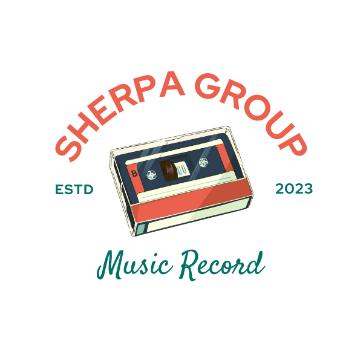

# Sherpa Group Records 


## Description
Welcome to Sherpa Records, this app was built using React, GraphQL, Express, Node.js, MUI, Stripe, MongoDB, and the Spotify API.

Our app provides a user-friendly interface where you can browse and stream our latest music releases, purchase merchandise securely with Stripe, and keep up to date with our upcoming concerts and events.

With the power of GraphQL, you can search our catalog of music and filter by artist, genre, or release date. We also integrate with the Spotify API, allowing you to easily access and play any of our tracks through the Spotify player.

Our app is built on a robust and scalable backend using Express and Node.js, with data stored in MongoDB. We use MUI for some of the front-end design, providing a sleek and responsive user interface.

We're excited to share our passion for music with you and hope you enjoy using our app. Thank you for choosing Sherpa Records!
## Table of Contents:
* [Installation](#installation)
* [Usage](#usage)
* [License](#license)
* [Credits](#credits)
* [Questions](#questions)
### Installation
```bash
git clone https://github.com/imjustSahen/Software-Sherpas
```
```bash
npm i
 ```
### Usage
You can view the deployed application [here](https://sherpa-studios.herokuapp.com/).


### License
This is app is covered under the [MIT License](https://opensource.org/licenses/MIT)

Copyright (C) Sherpa Records Music Group 2023
### Credits
- <a href="https://github.com/imjustSahen">Sahen Alexander</a>
- <a href="https://github.com/DelgaMatt">Matthew Delgado</a>
- <a href="https://github.com/wyamet">Wyatt Domanski</a>
- <a href="https://github.com/Samualjensen">Sam Jensen</a>
- <a href="https://github.com/justjulieta">Julieta Ramirez Solis Nguyen</a>


Thank you to <a href="https://open.spotify.com/">Spotify</a> for the use of the API.
### Questions
View the repository for this app on <a href="https://github.com/imjustSahen/Software-Sherpas">Github</a>.

If you have any questions regarding this application or if you would like to contribute, feel free to email any of our team by email at:

imjustsahen@gmail.com, matthewrdelgado@gmail.com, Wyattdomanski.md@gmail.com, samual.jensen@gmail.com, julieta.ramirez27@gmail.com.